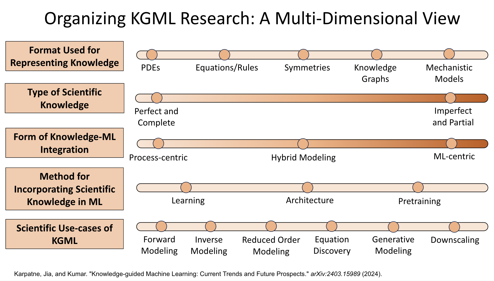

# AwesomeKGMLPapers

A community curated list of papers, datasets, models, researchers, workshops, funding opportunities in knowledge-guided machine learning (KGML). If you would like to get involved as a moderator or content creator, please send an email to: sadhikar1@stevens.edu with the subject: `KGML Content Moderation Volunteering` and with the body of the email including the request.

To contribute a paper, link to a dataset, model, or include yourself or someone you know as a KGML researcher, please send a pull request with a modification of the appropriate markdown file and our team will merge the request.

## Overview

<b>Format Used for Representing Knowledge</b>

Scientific knowledge in KGML can be represented in diverse mathematical or symbolic forms to be integrated into ML models. For example, 
<b>PDEs/Equations/Rules</b> employ mathematical formulations or heuristic rules to capture known physical relationships and directly embed domain expertise; <b>Symmetries/Invariances</b> involve incorporating invariant properties, such as rotational or translational symmetry, into network architectures to enhance generalization; <b>Knowledge Graphs</b> structure relationships between entities to ensure predictions remain consistent with established scientific connections; and <b>Mechanistic Models</b> combine detailed process-based models with ML to leverage existing simulation capabilities.

  

 <b>Type of Scientific Knowledge</b> 

Scientific knowledge in KGML can be categorized as <b>(1) Perfect and Complete</b> – where all system processes are fully described by exact scientific equations, such as partial differential equations (PDE#s), enabling ML models like PINNs and neural operators to serve as efficient solvers; <b>(2) Imperfect and Partial</b> – where knowledge is incomplete and/or contains approximations, requiring flexible integration methods like PGNNs and PGRNNs, which incorporate constraints while allowing for uncertainty. KGML research spans this continuum, adapting ML techniques based on the level of available scientific knowledge.

<b>Form of Knowledge-ML integration</b>

Frameworks for integrating Knowledge in ML vary based on whether ML or process-based components take center stage during prediction. In particular, we have the following frameworks: <b>Process-Centric:</b> ML is used to calibrate or enhance a traditional process-based model, with the physical model remaining the primary driver. <b>Hybrid:</b> Both ML and process-based components contribute to the final prediction, often through residual learning, to combine the strengths of each approach. <b>ML-Centric:</b> An ML model handles the main prediction task while being guided by physical constraints during training for scientific consistency.

 <b>Method for Incorporating Scientific Knowledge in ML</b>
 
Scientific knowledge can be integrated into ML through three key methods: <b>(1) Learning-Based Methods</b> – modify the learning process using knowledge-guided loss functions to enforce scientific principles, as seen in PGNNs, PGRNNs, and PINNs; <b>(2) Architecture-Based Methods</b> – embed scientific constraints directly into model design, creating knowledge-guided architectures like PGA-LSTM or models capturing symmetries and invariances of dynamical systems in the architecture of neural networks; <b>(3) Pretraining</b> – initialize model parameters using weights informed by scientific knowledge, e.g. by pretraining the model on simulations of science-based models before fine-tuning on real data.

<b> Scientific use-cases of KGML</b>

Practical applications of knowledge-guided ML span a range of scientific problems where predictions or data enhancements are required. For example: <b>Forward Modeling:</b> Predicts system outputs from given inputs, serving either as a surrogate or an improved process-based model. <b>Inverse Modeling:</b> Infers hidden parameters or system states from observations, aiding in calibration and deepening system understanding. <b>Generative Modeling:</b> Produces synthetic data that mimics the physical system, useful for simulations or filling data gaps. <b>Downscaling:</b> Converts coarse-scale information into finer resolutions using ML super-resolution techniques guided by physical constraints. <b>Reduced Order Modeling:</b> Simplifies complex systems into lower-dimensional representations that capture essential dynamics, making simulations computationally efficient while preserving critical system behavior. <b>Equation Discovery:</b> Identifies governing equations from data, providing insights into underlying physical laws and enabling the formulation of new or improved scientific models.

## Paper List

 Paper list 

| Pub. Date | Paper Title | Knowledge Format | Knowledge Type | Knowledge-ML Integration | Method of Knowledge-Guidance | Scientific Use-Case | Application Domain |
|------------|-------------|------------------|--------------------|--------------------------|-----------------------------|------------------------|--------------------|
| 02/01/2019 | [Physics-informed neural networks: A deep learning framework for solving forward and inverse problems involving nonlinear partial differential equations](https://www.sciencedirect.com/science/article/pii/S0021999118307125) | PDE | Perfect | ML-Centric | Learning | Forward Modeling; Inverse Modeling | |
| 07/29/2023 | [Physics-Informed Neural Operator for Learning Partial Differential Equations](https://arxiv.org/pdf/2111.03794) | PDE | Perfect | ML-Centric | Learning; Test-time optimization | Forward Modeling; Inverse Modeling; | |
| 12/06/2020 | [PhiFlow: A Differentiable PDE Solving Framework for Deep Learning via Physical Simulations](https://montrealrobotics.ca/diffcvgp/assets/papers/3.pdf) | PDE | Perfect | Hybrid-Modeling | Learning | Forward Modeling | |
| 08/16/2020 | [Combining Differentiable PDE Solvers and Graph Neural Networks for Fluid Flow Prediction](https://arxiv.org/abs/2007.04439) | Mechanistic Models | Imperfect and Partial | Hybrid-Modeling | Learning | Downscaling | |
| 12/10/2018 | [Incorporating Prior Domain Knowledge into Deep Neural Networks](https://ieeexplore.ieee.org/document/8621955) | Equations/Rules | Imperfect and Partial | ML-Centric | Learning | Forward Modeling | |
| 09/28/2021 | [Physics-Guided Neural Network (PGNN): An Application in Lake Temperature Modeling](https://arxiv.org/pdf/1710.11431) | | | | | |  |
| 04/01/2023 | [A physics-informed diffusion model for high-fidelity flow field reconstruction](https://www.sciencedirect.com/science/article/pii/S0021999123000670) | PDE | Perfect | ML-Centric | Learning | Forward Modeling; Generative Modeling |  |
| 04/15/2019 | [AI Feynman: A physics-inspired method for symbolic regression](https://www.science.org/doi/pdf/10.1126/sciadv.aay2631?fbclid=IwAR17FgGlF8KQTzQfBUxUI93dZPamVDCty_ReNY9iwvCnecrKZvLxt_-Q4gM) | Equations/Rules; Symmetries |  | Hybrid-Modeling | Learning | Equation Discovery | |
| 05/07/2024 | [PINNsFormer: A Transformer-Based Framework For Physics-Informed Neural Networks](https://arxiv.org/abs/2307.11833) | PDE | Perfect | ML-Centric | Learning| Forward Modeling; Inverse Modeling | |
| 10/02/2023 | [PhysDiff: Physics-Guided Human Motion Diffusion Model](https://openaccess.thecvf.com/content/ICCV2023/papers/Yuan_PhysDiff_Physics-Guided_Human_Motion_Diffusion_Model_ICCV_2023_paper.pdf) | Equations/Rules | Imerfect | ML-Centric | Learning | Generative Modeling | |
| 02/16/2025 | [Physics-Informed Diffusion Models](https://arxiv.org/pdf/2403.14404) | PDE | Perfect | ML-Centric | Learning | Forward Modeling; Inverse Modeling; Generative Modeling | |
| 07/23/2022 | [Physics-Informed Long-Sequence Forecasting From Multi-Resolution Spatiotemporal Data](https://www.ijcai.org/proceedings/2022/0304.pdf) | PDE; Equations | Perfect | ML-Centric | Architecture | Forward Modeling | |
| 06/09/2023 | [Physics-informed neural networks for modeling physiological time series for cuffless blood pressure estimation](https://www.nature.com/articles/s41746-023-00853-4) | Equations/Rules;| Perfect | ML-Centric | Learning | Forward Modeling | |

## Datasets

 Datasets

- [**ΦFlow**](https://tum-pbs.github.io/PhiFlow/)
- [**PDEArena**](https://github.com/pdearena/pdearena)
- [**The Well**](https://polymathic-ai.org/the_well/)
- [**Johns Hopkins Turbulence Database**](https://turbulence.idies.jhu.edu/home)
- [**BLASTNet Simulation Dataset**](https://blastnet.github.io/datasets)

## Workshops and Communities

 Workshops and Communities

- **[KGML Workshop Webpage](https://sites.google.com/vt.edu/kgml-bridge-aaai-25/home)**

- **[AI4Science](https://ai4sciencecommunity.github.io/)**

- **[SciML Oden Institute](https://sites.utexas.edu/scimlworkshop/)**

## Researchers
### Coming Soon

## Links to models
### Coming Soon

## Funding Opportunities
### Coming Soon

## Tutorials
### Coming Soon

