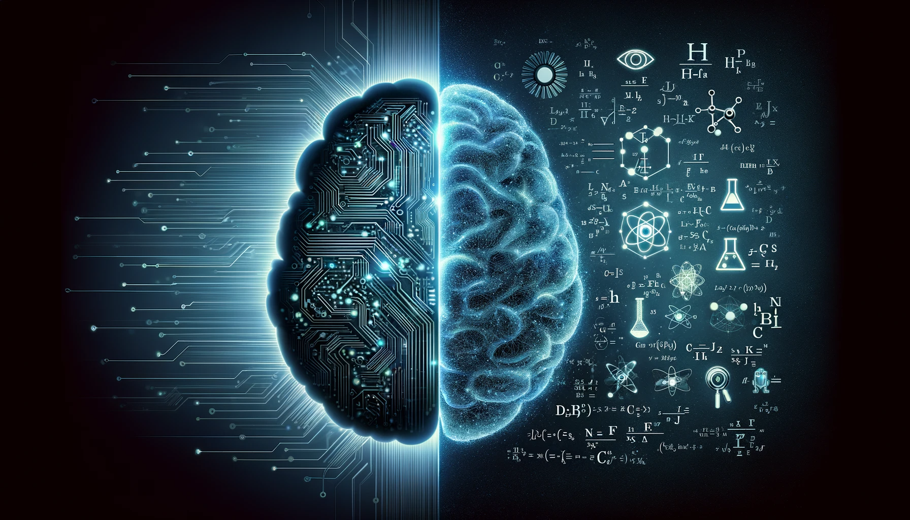

# AwesomeKGMLPapers

A community curated list of papers, datasets, models,  top researchers, workshops, funding opportunities in knowledge-guided machine learning (KGML). If you would like to get involved as a moderator or content creator, please send an email to: sadhikar1@stevens.edu with the subject: `KGML Content Moderation Volunteering` and with the body of the email including the request.

To contribute a paper, link to a dataset, model, or include yourself or someone you know as a KGML researcher, please send a pull request with a modification of the appropriate markdown file and our team will merge the request.

## Paper List

 Paper list 

| Pub. Date | Paper Title | Knowledge Format | Knowledge Type | Knowledge-ML Integration | Method of Knowledge-Guidance | Scientific Use-Case | Application Domain |
|------------|-------------|------------------|--------------------|--------------------------|-----------------------------|------------------------|--------------------|
| 02/01/2019 | [Physics-informed neural networks: A deep learning framework for solving forward and inverse problems involving nonlinear partial differential equations](https://www.sciencedirect.com/science/article/pii/S0021999118307125) | PDE | Perfect | ML-Centric | Learning | Forward Modeling; Inverse Modeling | |
| 07/29/2023 | [Physics-Informed Neural Operator for Learning Partial Differential Equations](https://arxiv.org/pdf/2111.03794) | PDE | Perfect | ML-Centric | Learning; Test-time optimization | Forward Modeling; Inverse Modeling; | |
| 12/06/2020 | [PhiFlow: A Differentiable PDE Solving Framework for Deep Learning via Physical Simulations](https://montrealrobotics.ca/diffcvgp/assets/papers/3.pdf) | PDE | Perfect | Hybrid-Modeling | Learning | Forward Modeling | |
| 08/16/2020 | [Combining Differentiable PDE Solvers and Graph Neural Networks for Fluid Flow Prediction](https://arxiv.org/abs/2007.04439) | Mechanistic Models | Imperfect and Partial | Hybrid-Modeling | Learning | Downscaling | |
| 12/10/2018 | [Incorporating Prior Domain Knowledge into Deep Neural Networks](https://ieeexplore.ieee.org/document/8621955) | Equations/Rules | Imperfect and Partial | ML-Centric | Learning | Forward Modeling | |
| 09/28/2021 | [Physics-Guided Neural Network (PGNN): An Application in Lake Temperature Modeling](https://arxiv.org/pdf/1710.11431) | | | | | |  |
| 04/01/2023 | [A physics-informed diffusion model for high-fidelity flow field reconstruction](https://www.sciencedirect.com/science/article/pii/S0021999123000670) | PDE | Perfect | ML-Centric | Learning | Forward Modeling; Generative Modeling |  |
| 04/15/2019 | [AI Feynman: A physics-inspired method for symbolic regression](https://www.science.org/doi/pdf/10.1126/sciadv.aay2631?fbclid=IwAR17FgGlF8KQTzQfBUxUI93dZPamVDCty_ReNY9iwvCnecrKZvLxt_-Q4gM) | Equations/Rules; Symmetries |  | Hybrid-Modeling | Learning | Equation Discovery | |
| 05/07/2024 | [PINNsFormer: A Transformer-Based Framework For Physics-Informed Neural Networks](https://arxiv.org/abs/2307.11833) | PDE | Perfect | ML-Centric | Learning| Forward Modeling; Inverse Modeling | |
| 10/02/2023 | [PhysDiff: Physics-Guided Human Motion Diffusion Model](https://openaccess.thecvf.com/content/ICCV2023/papers/Yuan_PhysDiff_Physics-Guided_Human_Motion_Diffusion_Model_ICCV_2023_paper.pdf) | Equations/Rules | Imerfect | ML-Centric | Learning | Generative Modeling | |
| 02/16/2025 | [Physics-Informed Diffusion Models](https://arxiv.org/pdf/2403.14404) | PDE | Perfect | ML-Centric | Learning | Forward Modeling; Inverse Modeling; Generative Modeling | |
| 07/23/2022 | [Physics-Informed Long-Sequence Forecasting From Multi-Resolution Spatiotemporal Data](https://www.ijcai.org/proceedings/2022/0304.pdf) | PDE; Equations | Perfect | ML-Centric | Architecture | Forward Modeling | |
| 06/09/2023 | [Physics-informed neural networks for modeling physiological time series for cuffless blood pressure estimation](https://www.nature.com/articles/s41746-023-00853-4) | Equations/Rules;| Perfect | ML-Centric | Learning | Forward Modeling | |

## Datasets

 Datasets

- [**ΦFlow**](https://tum-pbs.github.io/PhiFlow/)
- [**PDEArena**](https://github.com/pdearena/pdearena)
- [**The Well**](https://polymathic-ai.org/the_well/)
- [**Johns Hopkins Turbulence Database**](https://turbulence.idies.jhu.edu/home)
- [**BLASTNet Simulation Dataset**](https://blastnet.github.io/datasets)

## Workshops and Communities

 Workshops and Communities

- **[KGML Workshop Webpage](https://sites.google.com/vt.edu/kgml-bridge-aaai-25/home)**

- **[AI4Science](https://ai4sciencecommunity.github.io/)**

- **[SciML Oden Institute](https://sites.utexas.edu/scimlworkshop/)**

## Researcher

 Researcher

- **George Em Karniadakis** (Brown University)  
- **Maziar Raissi** (UC Boulder)  
- **Anuj Karpatne** (Virginia Tech)  
- **Vipin Kumar** (University of Minnesota)  
- **Xiaowei Jia** (University of Pittsburgh)  
- **Christopher Rackauckas** (MIT)  
- **Arka Daw** (ORNL)  
- **Ramakrishnan Kannan** (ORNL)  
- **Paris Perdikaris** (University of Pennsylvania)  
- **Licheng Liu** (University of Minnesota)  
- **Alexander Rodriguez** (University of Michigan, Ann Arbor)  
- **Aditya Prakash** (Georgia Tech)  
- **Nikhil Muralidhar** (Stevens Institute of Technology) 

## Links to model

 Links to model

### Coming Soon

---

## Funding Opportunities

 Funding Opportunities

### Coming Soon

## Tutorial

 Tutorial

### Coming Soon

